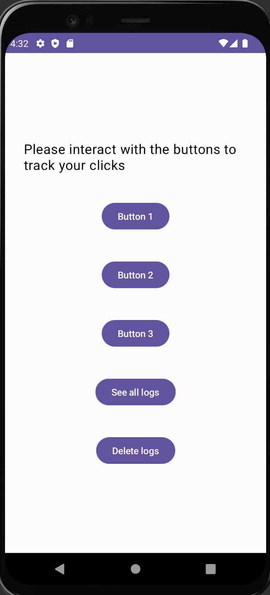
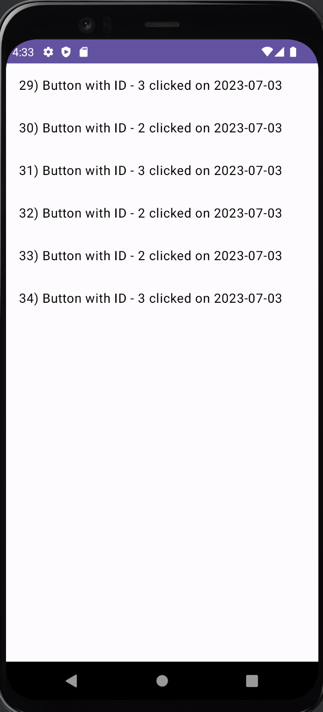

# Button Activity Tracker Application

This application created as a case study of certain basic concepts in android. Those are as follows

- Creating a basic view model application from scratch
- Create fragments and fragments transactions on certain user actions which includes inflating a list view
- Capturing button actions and storing those information on local Database using **Android Room** (It is a common practice to cache structured data on android local database)
- Dependency injection using **Dagger-Hilt** . We will injecting the database repository instance created for accessing database using Hilt.
- Holding the relevance of hilt dependency injection true, we will _**transform**_ the Fragment view based of Application to **Jetpack Compose** application

### The first 6 commits will take us through building blocks of applying few of the concepts mentioned above

## Screen Shots

